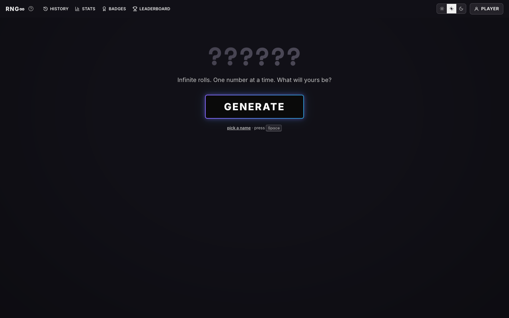

# RNG∞

A random number game with **no daily limit**, inspired by [rngdle.com](https://www.rngdle.com/).
Each roll gives a number between 0 and 1,000,000, scored by the original game's 233 badges (palindromes, primes, sequences, meme numbers…) that award EP,
plus custom badges defined in `tools/source/custom.json` — currently **Drastix** 💥: the number contains "235", 25,000 EP.

**[Play →](https://rng-infinite.vercel.app/)** (with the online leaderboard) · [GitHub Pages mirror](https://sacha9214.github.io/rng-infinite/)



## What it adds to the original

- Unlimited rolls (press **Space** to roll again); as in the original, neither the digits nor the badges can be skipped
- Full **history**: search by number or badge, filter by rarity, sort by EP
- **Stats**: rarity distribution vs. expected odds, EP per roll, digit frequency, streaks without a Rare
- **Collection** of all 233 badges with a counter, first roll and odds for each badge
- Previously rolled numbers are flagged, new badges are marked **NEW**
- JSON export/import of the history, 3 badge reveal speeds, light/dark theme

## Faithful to the original game

The engine (`js/engine.js`) is a rewrite, validated by `tools/build.mjs`:

1. all 1,000,001 possible numbers are analyzed, and each badge's score is derived from its actual frequency
   (`100 × 1,000,001 / number of matching numbers`); it must equal the reference score → **233/233**
2. the EP totals of 96 real rolls taken from the original leaderboard must match exactly → **96/96**

The percentile table (card rarity, "TOP x %") is computed from the same enumeration.

A Roblox version of the game, with the same Luau-ported engine, lives in [`roblox/`](roblox/).

## Run locally

Static site, no dependencies:

```bash
python3 -m http.server 8123
```

Regenerate the data after changing the engine:

```bash
node tools/build.mjs
```

Before each commit, version the CSS/JS files to bust the GitHub Pages cache:

```bash
node tools/stamp.mjs
```

Test the leaderboard functions against an in-memory Redis:

```bash
node tools/test-api.mjs
```

Run the site together with the API and an in-memory database (no account needed) on http://localhost:8124:

```bash
node tools/dev.mjs
```

## Online leaderboard

Hosted on Vercel, deployed on every push to `main`.

- `POST /api/roll`: the **server draws the number**, so nobody can pick their own 1337. It scores the roll with the same engine as the site and keeps each player's best roll for the day, the week and all time.
- `GET /api/leaderboard?period=day|week|all`: top 50, plus the caller's own rank and the number of rolls today.
- `POST /api/auth`: **Sign in with Google** (Google Identity Services). The server checks the ID token against Google's public keys, links the Google account to a player and gives each device its own secret, so the same account gets the same player on every device. Only the Google account ID is stored, never the email ([privacy policy](https://rng-infinite.vercel.app/privacy.html)).
- `POST /api/history`: the player's full roll history, so history, stats and badges follow a Google account on every device. Online rolls are added by `/api/roll`; on sign-in each device uploads the rolls only it had, and downloads the rest. Signing out only clears the device once every roll is confirmed on the account.
- Storage: Upstash Redis (Vercel Marketplace, free plan), one sorted set per period.
- Since rolls are unlimited, players are ranked by their **best single roll**, not by total EP.
- Each browser gets a random player id and a secret; only the holder of the secret can roll under that id. An 8 s cooldown matches the length of a reveal.
- Days reset at midnight UTC, like the original. If the server can't be reached, the roll still happens locally but doesn't count.

## License

[MIT](LICENSE)
